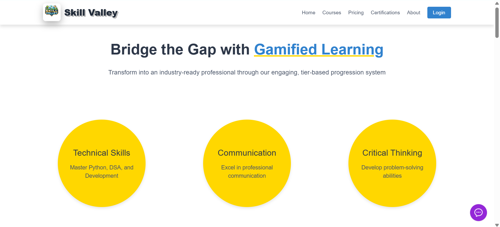

# Skill Valley  

🏆 **Nationwide Top 9 – Quasar Hackathon (Medicaps University)**  
📍 Dec 2024 – Feb 2025  

🔗 **Live Demo:** https://abilalgorithms.github.io/skill-valley/

---

## 🚨 The Problem

A significant gap exists between academic learning and real-world industry skill requirements.  
Students often lack structured guidance, engagement-driven progression, and measurable growth tracking.

---

## 💡 The Solution

**Skill Valley** is an AI-integrated, gamification-based upskilling platform designed to bridge the industry–academia divide.

It combines:
- Intelligent chatbot-led guidance  
- Gamified learning challenges  
- Structured growth tracking  
- Holistic skill development (technical + communication + intellectual growth)

---

## 🎮 Core Features

- 🧠 AI-powered conversational guidance  
- 🎯 Gamified challenge progression system  
- 📊 Growth tracking dashboard  
- 🏅 Achievement & milestone system  
- 🗂 Structured learning pathways  

---

## 🛠 Tech Stack

- HTML5  
- CSS3  
- Tailwind CSS  
- JavaScript  
- Responsive Design Principles  

---

## 🤝 Collaboration & Mentorship

Developed as part of the **Quasar Hackathon**, collaborating with:
- Team members on product flow & UX design  
- Corporate mentors  
- Senior developers  

Contributed to:
- Concept architecture  
- User journey mapping  
- Pitch deck creation  
- Frontend implementation  

---

## 🚀 Impact

Selected among the **Top 9 teams Nationwide**, validating the platform’s innovation, feasibility, and real-world relevance.

---

## 🔗 Live Access

👉 https://abilalgorithms.github.io/skill-valley/
